# IBM AML RiskIQ Enterprise Suite

[](https://github.com/rnanda19/IBM_AML_RiskIQ_Enterprise_Suite/actions/workflows/ci.yml)
[](https://github.com/rnanda19/IBM_AML_RiskIQ_Enterprise_Suite/actions/workflows/code-quality.yml)
[](https://github.com/rnanda19/IBM_AML_RiskIQ_Enterprise_Suite/actions/workflows/codeql.yml)
[](https://github.com/rnanda19/IBM_AML_RiskIQ_Enterprise_Suite/actions/workflows/docker-verify.yml)
[]()
[]()
[](LICENSE)

Enterprise AI-Driven Anti-Money Laundering & Financial Crime Intelligence Platform.
Independent professional portfolio project. Not affiliated with IBM or any financial institution.

## System Architecture

```mermaid
flowchart LR
    A["IBM AML-Data\ngithub.com/IBM/AML-Data\n(synthetic transactions)"] --> NB

    subgraph NB["Per-BP Notebooks (BP1, BP2, BP4, BP5)"]
        direction TB
        N1["01 Business Understanding"] --> N2["02 Feature Engineering + Modeling"]
        N2 --> N3["03 Statistical Validation (2-gate SOP)"]
        N3 --> N4["04 Compliance Reporting"]
    end

    NB3B["BP3 Notebooks\n(graph/rule signal, no trained model)"] --> MDL
    NB --> MDL

    subgraph MDL["models/ -- gitignored, SHA-256 verified"]
        direction TB
        M1["BP1 XGBoost"]
        M2["BP2 RandomForest + LabelEncoder"]
        M3["BP3 Rule JSON (2-hop proximity)"]
        M4["BP4 XGBoost"]
        M5["BP5 XGBoost"]
    end

    MDL --> SVC

    subgraph SVC["src/services/ -- FastAPI scoring layer"]
        direction TB
        S1["bp1_scoring_service  :8000"]
        S2["bp2_scoring_service  :8001"]
        S3["bp3_rule_scoring_service  :8003"]
        S4["bp4_scoring_service  :8001"]
        S5["bp5_scoring_service  :8002"]
        SEC["_security.py\nAPI-key auth + rate limit + audit log"]
        REG["_model_registry.py\nlive SHA-256 + mtime under /health"]
        SEC -.-> S1
        SEC -.-> S2
        SEC -.-> S3
        SEC -.-> S4
        SEC -.-> S5
        REG -.-> S1
        REG -.-> S2
        REG -.-> S4
        REG -.-> S5
    end

    SVC --> DOC

    subgraph DOC["src/docker/ -- one Dockerfile + docker-compose.yml per BP"]
        direction TB
        D1["BP1 / BP2 / BP4 / BP5 containers\n(build + run verified in CI)"]
        D2["BP3 container\n(pending lookup-parquet artifact, disclosed)"]
        D3["BP6 container\n(one-shot batch rollup job, no port)"]
    end

    DOC --> CI

    subgraph CI["CI/CD -- .github/workflows"]
        direction TB
        C1["ci.yml: black/isort/flake8/mypy + pytest (52 tests)"]
        C2["code-quality.yml: bandit + format"]
        C3["codeql.yml: CodeQL security scan"]
        C4["docker-verify.yml: build + poll /health (BP1/2/4/5)"]
    end

    N4 --> REP
    subgraph REP["reports/ + BENCHMARKS.md"]
        direction TB
        R1["MODEL_CARD.md / RULE_CARD.md\n(per BP1-BP5)"]
        R2["BP6 PLATFORM_CARD.md\n(pure rollup, no model of its own)"]
        R1 --> R2
    end
```



Every box above is a real, committed component of this repository -- there is no hosted/live deployment layer
yet (see `ROADMAP.md`). BP3's Docker image and BP6's batch-job image are both real and buildable, but
disclosed as not yet end-to-end verified: BP3 depends on an artifact (`*_near_train_flagged_lookup_*.parquet`)
this platform has not yet generated, and BP6 has no port/`/health` endpoint to poll (it is a one-shot report
job, not a scoring API) -- see `scripts/check_docker_copy_paths.py` and `.github/workflows/docker-verify.yml`
for exactly how each is scoped.

## Table of Contents
- [Dataset](#dataset)
- [Methodology lineage](#methodology-lineage)
- [Business Problems](#business-problems-6---finalized-real-ground-truth-verified)
- [Platform at a Glance](#platform-at-a-glance)
- [Repository Structure](#repository-structure)
- [How to Run](#how-to-run)
- [Engineering & Testing](#engineering--testing)
- [Status](#status)
- [Execution boundary](#execution-boundary-standing-rule)
- [Storage location](#storage-location-strict)
- [License](#license)

## Dataset
Sourced directly from **IBM's own GitHub repository** (`github.com/IBM/AML-Data`), which publishes and
documents this financial-transaction dataset for anti-money-laundering research. Generated by IBM using a
multi-agent virtual-world simulation -- per IBM's own README: "the model and data are NOT based on
obfuscating or anonymizing real individuals. Everything is synthetic." No real account holder, real
transaction, or real financial institution is represented anywhere in this dataset or in this repository's
outputs. Also described in IBM Research's own paper: Altman et al., NeurIPS 2023 / arXiv:2306.16424. See
`DATA_PRIVACY.md` for the full data-handling policy, including exactly what raw data is deliberately
excluded from this repo and why.

## Methodology lineage
AMEX RiskIQ Enterprise Credit Risk Platform -> Home Credit RiskIQ 5-Mega-Project Suite -> FraudShield
Enterprise Risk Intelligence Platform -> Customer360 Navigator Enterprise Suite -> IBM AML RiskIQ (this
project). Standing rules inherited across all five: zero-fabrication, the Claude execution-boundary rule,
WARP (runtime performance), HYPER (delivery speed), the 6-Gate governance SOP, and the Evidence Ledger. See
`LESSONS_LEARNED_APPLIED.md` for the specific real bugs from the earlier builds this structure and its
conventions were designed to prevent.

## Business Problems (6) - finalized, real-ground-truth-verified
BP1 Transaction Monitoring & Suspicious Activity Detection - BP2 Typology & Red-Flag Pattern Detection -
BP3 Transaction Network & Graph Intelligence - BP4 Structuring & Smurfing Detection -
BP5 Correspondent Banking & Cross-Border Wire Risk - BP6 Enterprise AML Compliance Monitoring & Regulatory
Reporting.

Each BP is independently solvable with real ground truth in the dataset (BP1: `Is Laundering`; BP2:
`Patterns.txt`'s block-structured typology labels; BP3/BP4/BP5: real structural/behavioral fields, no proxy
label needed; BP6: pure rollup of BP1-BP5's own outputs). Naming cross-checked against real primary-source
terminology from a Federal Reserve consent order (American Express Bank International) and a FinCEN civil
money penalty assessment (JPMorgan Chase).

Four BPs from the original 8-BP scaffold were dropped on review: Account/Entity AML Risk Scoring and Alert
Escalation/SAR-Filing Prediction both lack an independent ground-truth label in this dataset (proxy-only);
GenAI SAR Narrative Assistant is a generation task with nothing to validate output against; Alert Prioritization
is a composite/policy layer, not an independently trained model. See `PROJECT_STRUCTURE_LOCKED.md` for the
full naming history.

## Platform at a Glance
Every row below is PASS on its locked mandatory realism-validation tier (LI-Medium) -- see `BENCHMARKS.md`
for the full real baseline-vs-model comparison and `docs/evidence_ledger/EVIDENCE_LEDGER.md` for the single
source of truth this table is drawn from.

| BP | Champion / Signal | Real Metric (LI-Medium) | Verdict |
|---|---|---|---|
| BP1 Transaction Monitoring | XGBoost | Test PR-AUC 0.1242 | PASS |
| BP2 Typology & Red-Flag Detection | RandomForest | Test macro-F1 0.4440 | PASS |
| BP3 Network & Graph Intelligence | 2-hop proximity to a TRAIN-flagged account (rule) | Network-lift ratio 3.19x | PASS |
| BP4 Structuring & Smurfing Detection | XGBoost | Test PR-AUC 0.1253 | PASS |
| BP5 Correspondent Banking & Cross-Border Risk | XGBoost | Test PR-AUC 0.1399 | PASS |
| BP6 Enterprise Compliance Monitoring | Pure rollup of BP1-BP5 (no model) | Reconciliation gate | PASS |

Platform-wide financial rollup (3 categories, never blended -- see `BENCHMARKS.md`/`MODEL_REGISTRY.md`):
false-positive-reduction savings across BP1+BP4+BP5 **$13.88M** (213,496 investigator hours); true-positive
illustrative regulatory-exposure-avoidance across BP1+BP4+BP5 **$97.95M** (+1,959 cases); BP2's own typology
auto-typing/confirmation value **$1,313 + $1.10M**, kept separate (different unit basis). Every dollar figure
is an explicitly labeled ASSUMPTION -- see `BENCHMARKS.md` and each BP's own `MODEL_CARD.md`/`PLATFORM_CARD.md`.

## Repository Structure
See `PROJECT_STRUCTURE_LOCKED.md` for the authoritative folder layout and the rule that it does not get
renamed or reorganized once notebooks start writing paths into it. At a glance:

| Path | Contents |
|---|---|
| `notebooks/` | `00_hardware_benchmark/` + one folder per BP; each BP is 4 real single-cell scripts (BP6 is 1 consolidated `.ipynb`) |
| `src/{services,features,reporting,monitoring}/` | Shared component library -- FastAPI scoring services, feature engineering, report building, drift monitoring |
| `src/docker/` | One `Dockerfile` + `docker-compose.yml` + `.dockerignore` per BP |
| `tests/` | `shared/` plus one folder per BP, pytest (52 tests, all passing) |
| `models/` | Trained artifacts per BP -- gitignored by default; the 6 small champion files `MODEL_REGISTRY.md` documents by SHA-256 are committed as an exception |
| `reports/` | `MODEL_CARD.md`/`RULE_CARD.md`/`PLATFORM_CARD.md` + `CHANGELOG.md` per BP |
| `configs/` | Per-BP YAML + resource-limit (WARP) ceilings |
| `docs/` | Evidence Ledger, compliance mapping, data dictionary |
| `.github/` | CI workflows, issue/PR templates, CODEOWNERS, Dependabot |
| `kaggle/`, `linkedin/` | Portfolio-publishing packaging notes |

## How to Run
```bash
# install
pip install -r requirements.txt
pip install -e .

# run the real test suite (52 tests)
make test              # or: pytest tests/ -v

# full local quality gate (lint + mypy + bandit + test)
make test-all

# run a single scoring service locally (BP1 shown; see each BP's own Dockerfile for its port)
uvicorn src.services.bp1_scoring_service:app --reload --port 8000
curl http://localhost:8000/health

# build + run a service's real Docker image
docker compose -f src/docker/bp1_transaction_monitoring_detection/docker-compose.yml up --build
```
Every `/score` endpoint is open-mode by default (no key required) and switches to enforced API-key auth the
moment `AML_RISKIQ_API_KEYS` is set in the environment -- see `SECRETS_MANAGEMENT.md` and `.env.example`.

## Engineering & Testing
- **Tests:** 52/52 passing (`pytest tests/`), covering all 5 FastAPI scoring services plus the shared
  `_security.py`/`_model_registry.py` modules (real 429 rate-limit and 401/200 auth integration tests, not
  mocked).
- **Type checking:** `mypy src/` -- 0 errors across 15 source files.
- **Security scanning:** `bandit -r src/` -- 0 blocking findings, 7 low-severity baseline (see `SECURITY.md`);
  CodeQL runs weekly + on every push/PR.
- **Hardening:** API-key authentication, per-route rate limiting (`slowapi`), and structured JSON audit
  logging on every scoring request -- added across BP1/BP2/BP4/BP5 in the 2026-10-02 hardening pass.
- **Model registry:** every running service recomputes its own champion model's SHA-256 (streamed) and
  filesystem mtime at import time and exposes both under `/health` -- see `MODEL_REGISTRY.md`.
- **Docker:** a real, permanent regression guard (`scripts/check_docker_copy_paths.py`, wired into CI)
  caught and fixed a genuine bug where 5 of 5 Dockerfiles never copied their required validation-report JSON
  into the image.

## Status
BP1, BP2, BP3, BP4, and BP5 have each completed real validation and passed both the structural and
statistical-robustness gates on their mandatory LI-Medium tier; BP6's platform-wide rollup passes its own
reconciliation gate as a pure pass-through of those five verdicts. All 5 FastAPI scoring services are
hardened (auth/rate-limit/audit-log) and covered by a passing 52-test suite. See
`docs/evidence_ledger/EVIDENCE_LEDGER.md` for the single source of truth and `ROADMAP.md` for what remains
(BP3's pending lookup-parquet artifact, live Docker build verification in CI, and GitHub publication --
now complete).

## Execution boundary (standing rule)
Claude generates notebooks and src/ modules only, and never executes the real data-processing pipeline itself.
You run every notebook on your own machine; all real numbers, charts and verdicts come from your own reported run.

## Storage location (strict)
Every file for this project - notebooks, src/ modules, trained-model artifacts, reports, configs, the
GitHub/Kaggle/LinkedIn packaging folders, everything - lives inside this one folder tree, under
`C:\Users\rnand\Documents\IBM_AML_RiskIQ_Enterprise_Suite\`, and nowhere else on this laptop.
Nothing for this project is written to Downloads, the home directory, or any other path.

## License
All Rights Reserved -- this repository is shared publicly for portfolio and demonstration purposes only. It
is not licensed for reuse, modification, or redistribution; see `LICENSE` for details.

---
Built by [Nandagopal](https://github.com/rnanda19).
