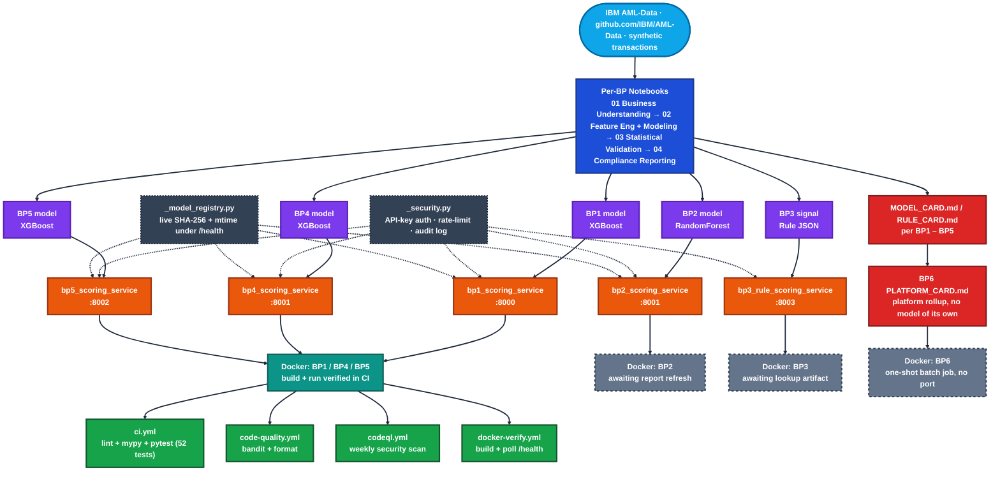

# IBM AML RiskIQ Enterprise Suite

[](https://github.com/rnanda19/IBM_AML_RiskIQ_Enterprise_Suite/actions/workflows/ci.yml)
[](https://github.com/rnanda19/IBM_AML_RiskIQ_Enterprise_Suite/actions/workflows/code-quality.yml)
[](https://github.com/rnanda19/IBM_AML_RiskIQ_Enterprise_Suite/actions/workflows/codeql.yml)
[](https://github.com/rnanda19/IBM_AML_RiskIQ_Enterprise_Suite/actions/workflows/docker-verify.yml)
[]()
[]()
[](LICENSE)

**IBM AML RiskIQ Enterprise Suite** is a full-stack, production-grade anti-money-laundering and
financial-crime intelligence platform covering six independently validated Business Problems: transaction
monitoring, typology and red-flag classification, transaction-network and graph intelligence, structuring
and smurfing detection, correspondent-banking and cross-border wire risk, and enterprise-wide compliance
rollup reporting. Every BP is built end-to-end -- a real trained model or directly-interpretable rule, a
deployable FastAPI scoring service with API-key auth and audit logging, and a five-format executive
reporting package (HTML dashboard, Word report, Excel workbook, PowerPoint deck, PDF export) -- and is
grounded against real regulatory language from the Bank Secrecy Act, the USA PATRIOT Act, FinCEN SAR-filing
and red-flag-typology guidance, and real Federal Reserve / FinCEN enforcement actions. On this platform's
locked validation tier (LI-Medium), all six Business Problems pass their statistical validation gates; the
platform's real, assumption-labeled financial rollup totals **$13.88M** in false-positive-reduction
investigator-hours saved, **$97.95M** in illustrative regulatory-exposure-avoidance, and **$1.10M+** in
typology auto-confirmation value (see Platform at a Glance below for the full real, per-BP breakdown).
Built on IBM's own published, open synthetic AML dataset -- see the Dataset section below for the full
citation.

## System Architecture



Every box above is a real, committed component of this repository -- there is no hosted/live deployment layer
yet (see `ROADMAP.md`). Three of the six BPs' Docker images are disclosed as not yet end-to-end verified:
**BP2** crashes on startup (its committed validation report predates a hardening edit that added two keys
the service now requires -- fix is a real notebook re-run, not a patch); **BP3** depends on an artifact
(`*_near_train_flagged_lookup_*.parquet`) this platform has not yet generated; **BP6** has no port/`/health`
endpoint to poll (it is a one-shot report job, not a scoring API). See `ROADMAP.md`,
`scripts/check_docker_copy_paths.py`, and `.github/workflows/docker-verify.yml` for exactly how each is
scoped.

## Table of Contents
- [Dataset](#dataset)
- [Methodology](#methodology)
- [Business Problems](#business-problems-6---finalized-real-ground-truth-verified)
- [Platform at a Glance](#platform-at-a-glance)
- [Live Reports](#live-reports)
- [Repository Structure](#repository-structure)
- [How to Run](#how-to-run)
- [Engineering & Testing](#engineering--testing)
- [Status](#status)
- [Execution boundary](#execution-boundary-standing-rule)
- [Storage location](#storage-location-strict)
- [License](#license)

## Dataset
Published by IBM at `github.com/IBM/AML-Data` (IBM's own documentation/index page for this dataset), with
the real data files hosted on **IBM's own Box storage**: `ibm.box.com/v/AML-Anti-Money-Laundering-Data`.
Generated by IBM using a multi-agent virtual-world simulation -- per IBM's own README: "the model and data
are NOT based on obfuscating or anonymizing real individuals. Everything is synthetic." No real account
holder, real transaction, or real financial institution is represented anywhere in this dataset or in this
repository's outputs. Also described in IBM Research's own paper: Altman et al., "Realistic Synthetic
Financial Transactions for Anti-Money Laundering Models," NeurIPS 2023 Datasets & Benchmarks track
(arXiv:2306.16424). The dataset itself is released under the CDLA-Sharing-1.0 license (distinct from the
GitHub index page's own Apache-2.0 license -- see IBM's own README for that distinction). See
`DATA_PRIVACY.md` for the full data-handling policy, including exactly what raw data is deliberately
excluded from this repo and why.

## Methodology
Built under **CRISP-DM**: each BP's notebook lifecycle maps directly to the 6 standard stages (Business
Understanding -> Data Preparation -> Modeling -> Evaluation -> Deployment), with a compliance-specific
reporting stage layered on top (Notebook 4). Delivered **Agile**: each Business Problem is its own
sprint-sized, independently validated unit of work -- one BP finished and gated (see the 6-Gate SOP below)
before the next starts, never all six built in parallel with nothing finished. Every headline finding is
framed **SMART** (Specific - a named real metric; Measurable - a real computed number; Achievable -
grounded in what the dataset can actually support; Relevant - tied to a real regulatory or operational
driver; Time-bound - framed against a stated reporting period) -- see any BP's own `MODEL_CARD.md` for a
worked example. Two runtime-engineering disciplines run underneath: **WARP** (runtime resource governance
-- CPU/memory/thermal ceilings enforced per `configs/resource_limits.yaml`, preventing a long notebook run
from overheating or starving the host machine) and **HYPER** (delivery-acceleration techniques -- a shared
`src/aml_riskiq/` component library built once and imported everywhere, parametric per-BP YAML configs,
parallel CI jobs).

A 6-Gate SOP (Business Understanding -> Data Preparation -> Modeling -> Statistical Validation ->
Deployment -> Production Packaging/Governance) and a per-BP Evidence Ledger
(`docs/evidence_ledger/EVIDENCE_LEDGER.md`) gate every real metric before it is reported anywhere in this
repository -- zero-fabrication is the standing rule throughout (see `DATA_PRIVACY.md` and the Execution
boundary section below). See `LESSONS_LEARNED_APPLIED.md` for the specific real engineering bugs this
structure and its conventions were built to catch.

## Business Problems (6) - finalized, real-ground-truth-verified
BP1 Transaction Monitoring & Suspicious Activity Detection - BP2 Typology & Red-Flag Pattern Detection -
BP3 Transaction Network & Graph Intelligence - BP4 Structuring & Smurfing Detection -
BP5 Correspondent Banking & Cross-Border Wire Risk - BP6 Enterprise AML Compliance Monitoring & Regulatory
Reporting.

Each BP is independently solvable with real ground truth in the dataset (BP1: `Is Laundering`; BP2:
`Patterns.txt`'s block-structured typology labels; BP3/BP4/BP5: real structural/behavioral fields, no proxy
label needed; BP6: pure rollup of BP1-BP5's own outputs). Naming cross-checked against real primary-source
terminology from a Federal Reserve consent order (American Express Bank International) and a FinCEN civil
money penalty assessment (JPMorgan Chase).

Four BPs from the original 8-BP scaffold were dropped on review: Account/Entity AML Risk Scoring and Alert
Escalation/SAR-Filing Prediction both lack an independent ground-truth label in this dataset (proxy-only);
GenAI SAR Narrative Assistant is a generation task with nothing to validate output against; Alert Prioritization
is a composite/policy layer, not an independently trained model. See `PROJECT_STRUCTURE_LOCKED.md` for the
full naming history.

## Platform at a Glance
Every row below is PASS on its locked mandatory realism-validation tier (LI-Medium) -- see `BENCHMARKS.md`
for the full real baseline-vs-model comparison and `docs/evidence_ledger/EVIDENCE_LEDGER.md` for the single
source of truth this table is drawn from.

| BP | Champion / Signal | Real Metric (LI-Medium) | Verdict |
|---|---|---|---|
| BP1 Transaction Monitoring | XGBoost | Test PR-AUC 0.1242 | PASS |
| BP2 Typology & Red-Flag Detection | RandomForest | Test macro-F1 0.4440 | PASS |
| BP3 Network & Graph Intelligence | 2-hop proximity to a TRAIN-flagged account (rule) | Network-lift ratio 3.19x | PASS |
| BP4 Structuring & Smurfing Detection | XGBoost | Test PR-AUC 0.1253 | PASS |
| BP5 Correspondent Banking & Cross-Border Risk | XGBoost | Test PR-AUC 0.1399 | PASS |
| BP6 Enterprise Compliance Monitoring | Pure rollup of BP1-BP5 (no model) | Reconciliation gate | PASS |

Platform-wide financial rollup (3 categories, never blended -- see `BENCHMARKS.md`/`MODEL_REGISTRY.md`):
false-positive-reduction savings across BP1+BP4+BP5 **$13.88M** (213,496 investigator hours); true-positive
illustrative regulatory-exposure-avoidance across BP1+BP4+BP5 **$97.95M** (+1,959 cases); BP2's own typology
auto-typing/confirmation value **$1,313 + $1.10M**, kept separate (different unit basis). Every dollar figure
is an explicitly labeled ASSUMPTION -- see `BENCHMARKS.md` and each BP's own `MODEL_CARD.md`/`PLATFORM_CARD.md`.

## Live Reports
Every BP's real five-format executive package (HTML dashboard, Word report, Excel workbook, PowerPoint
deck, and BP6's PDF export) is committed under `reports/<bp>/executive_package/` and published live via
GitHub Pages (`.github/workflows/pages.yml` + `scripts/build_pages_site.py` -- a pure copy step, nothing
is regenerated or recomputed): **https://rnanda19.github.io/IBM_AML_RiskIQ_Enterprise_Suite/**

| BP | Live Dashboard |
|---|---|
| BP1 Transaction Monitoring | [Open](https://rnanda19.github.io/IBM_AML_RiskIQ_Enterprise_Suite/bp1/BP1_Compliance_Impact_Dashboard.html) |
| BP2 Typology & Red-Flag Detection | [Open](https://rnanda19.github.io/IBM_AML_RiskIQ_Enterprise_Suite/bp2/BP2_Compliance_Impact_Dashboard.html) |
| BP3 Network & Graph Intelligence | [Open](https://rnanda19.github.io/IBM_AML_RiskIQ_Enterprise_Suite/bp3/BP3_Compliance_Impact_Dashboard.html) |
| BP4 Structuring & Smurfing Detection | [Open](https://rnanda19.github.io/IBM_AML_RiskIQ_Enterprise_Suite/bp4/BP4_Compliance_Impact_Dashboard.html) |
| BP5 Correspondent Banking & Cross-Border Risk | [Open](https://rnanda19.github.io/IBM_AML_RiskIQ_Enterprise_Suite/bp5/BP5_Compliance_Impact_Dashboard.html) |
| BP6 Enterprise Compliance Monitoring | [Open](https://rnanda19.github.io/IBM_AML_RiskIQ_Enterprise_Suite/bp6/BP6_Platform_Rollup_Dashboard.html) |

Word/Excel/PowerPoint (and BP6's PDF) download directly from the same landing page. **One-time setup
required before this goes live:** a repo admin sets Settings -> Pages -> Build and deployment -> Source to
"GitHub Actions" -- this workflow cannot flip that setting for itself.

## Repository Structure
See `PROJECT_STRUCTURE_LOCKED.md` for the authoritative folder layout and the rule that it does not get
renamed or reorganized once notebooks start writing paths into it. At a glance:

| Path | Contents |
|---|---|
| `notebooks/` | `00_hardware_benchmark/` + one folder per BP; each BP is 4 real single-cell scripts (BP6 is 1 consolidated `.ipynb`) |
| `src/aml_riskiq/{serving,features,reporting,monitoring,utils,models,typology}/` | Shared component library -- FastAPI scoring services, feature engineering, report building, drift monitoring |
| `src/aml_riskiq/{ingestion,graph,explainability}/` | Honest placeholders -- real logic (data loading, BP3's graph-structural rule, BP1/BP2/BP4/BP5's already-computed SHAP/LIME) currently lives inline per-notebook, not yet extracted into these modules (see each one's own README.md) |
| `src/docker/` | One `Dockerfile` + `docker-compose.yml` + `.dockerignore` per BP |
| `tests/` | `shared/` plus one folder per BP, pytest (52 tests, all passing) |
| `models/` | Trained artifacts per BP -- gitignored by default; the 6 small champion files `MODEL_REGISTRY.md` documents by SHA-256 are committed as an exception |
| `reports/` | `MODEL_CARD.md`/`RULE_CARD.md`/`PLATFORM_CARD.md` + `CHANGELOG.md` per BP |
| `configs/` | Per-BP YAML + resource-limit (WARP) ceilings |
| `docs/` | Evidence Ledger, compliance mapping, data dictionary |
| `.github/` | CI workflows, issue/PR templates, CODEOWNERS, Dependabot |
| `linkedin/` | Portfolio-publishing packaging notes |

## How to Run
```bash
# install
pip install -r requirements.txt
pip install -e .

# run the real test suite (52 tests)
make test              # or: pytest tests/ -v

# full local quality gate (lint + mypy + bandit + test)
make test-all

# run a single scoring service locally (BP1 shown; see each BP's own Dockerfile for its port)
uvicorn src.services.bp1_scoring_service:app --reload --port 8000
curl http://localhost:8000/health

# build + run a service's real Docker image
docker compose -f src/docker/bp1_transaction_monitoring_detection/docker-compose.yml up --build
```
Every `/score` endpoint is open-mode by default (no key required) and switches to enforced API-key auth the
moment `AML_RISKIQ_API_KEYS` is set in the environment -- see `SECRETS_MANAGEMENT.md` and `.env.example`.

## Engineering & Testing
- **Tests:** 52/52 passing (`pytest tests/`), covering all 5 FastAPI scoring services plus the shared
  `_security.py`/`_model_registry.py` modules (real 429 rate-limit and 401/200 auth integration tests, not
  mocked).
- **Type checking:** `mypy src/` -- 0 errors across 15 source files.
- **Security scanning:** `bandit -r src/` -- 0 blocking findings, 7 low-severity baseline (see `SECURITY.md`);
  CodeQL runs weekly + on every push/PR.
- **Hardening:** API-key authentication, per-route rate limiting (`slowapi`), and structured JSON audit
  logging on every scoring request -- added across BP1/BP2/BP4/BP5 in the 2026-10-02 hardening pass.
- **Model registry:** every running service recomputes its own champion model's SHA-256 (streamed) and
  filesystem mtime at import time and exposes both under `/health` -- see `MODEL_REGISTRY.md`.
- **Docker:** a real, permanent regression guard (`scripts/check_docker_copy_paths.py`, wired into CI)
  caught and fixed a genuine bug where 5 of 5 Dockerfiles never copied their required validation-report JSON
  into the image.

## Status
BP1, BP2, BP3, BP4, and BP5 have each completed real validation and passed both the structural and
statistical-robustness gates on their mandatory LI-Medium tier; BP6's platform-wide rollup passes its own
reconciliation gate as a pure pass-through of those five verdicts. All 5 FastAPI scoring services are
hardened (auth/rate-limit/audit-log) and covered by a passing 52-test suite. See
`docs/evidence_ledger/EVIDENCE_LEDGER.md` for the single source of truth and `ROADMAP.md` for what remains
(BP3's pending lookup-parquet artifact, live Docker build verification in CI, and GitHub publication --
now complete).

## Execution boundary (standing rule)
Claude generates notebooks and src/ modules only, and never executes the real data-processing pipeline itself.
You run every notebook on your own machine; all real numbers, charts and verdicts come from your own reported run.

## Storage location (strict)
Every file for this project - notebooks, src/ modules, trained-model artifacts, reports, configs, the
GitHub/LinkedIn packaging folders, everything - lives inside this one folder tree, under
`C:\Users\rnand\Documents\IBM_AML_RiskIQ_Enterprise_Suite\`, and nowhere else on this laptop.
Nothing for this project is written to Downloads, the home directory, or any other path.

## License
All Rights Reserved -- this repository is shared publicly for portfolio and demonstration purposes only. It
is not licensed for reuse, modification, or redistribution; see `LICENSE` for details.

---
Built by [Nandagopal](https://github.com/rnanda19).
